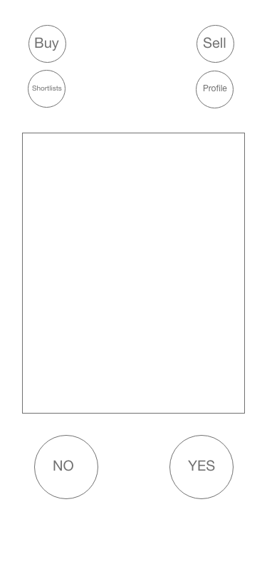
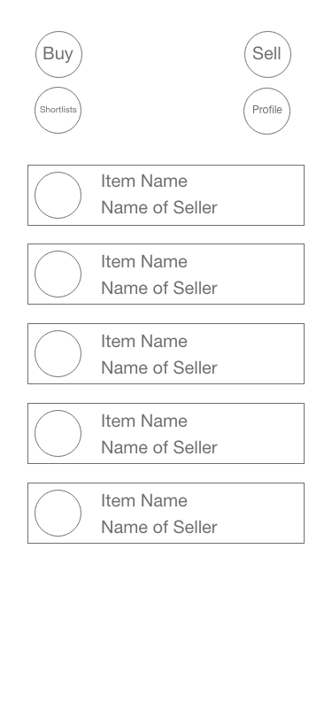
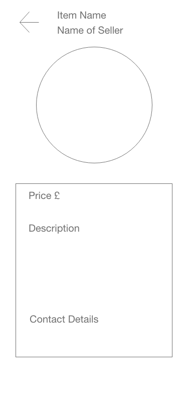
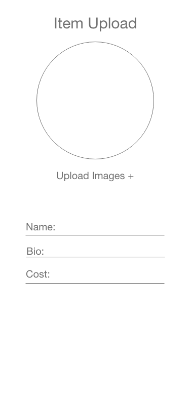
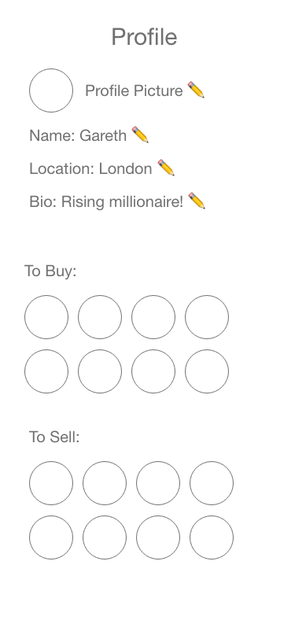

# Swipe and Shop 🛒

An app to buy and sell items using a Tinder style selection process

# Tech Stack:

- MongoDB
- Express JS
- React JS/React Native
- Node JS
- Bootstrap
- Cypress
- npm

## User Stores (Behavioural Driven Development)

```
As a User
So that I can create my account
I want to be able to sign up
```

```
As a User
So that I can use Swipe and Shop
I want to be able to login
```

```
As a User
So that I can sell an item
I want to be able to post an item
```

```
As a User
So that I can buy an item
I can view all posted items
```

```
As a User
So that I can make my searches more specific
I want to be able to filter posted results
```

```
As a User
So that I can sell my item
I want to be able to set the price of my item
```

```
As a User
So that I can tell buyers what the item is
I want to be able to create a description for the item
```

```
As a User
So that I can find out more about the item
I want to be able to message the buyer to discuss the details
```

```
As a User
So that I can talk to my customers
I want to be able to message the customers to discuss the details
```

## Database

`USER` table:

| field     | type              |
| --------- | ----------------- |
| USER ID   | PRIMARY SERIAL ID |
| EMAIL     | VARCHAR(200)      |
| PASSWORD  | VARCHAR(60)       |
| USERNAME  | VARCHAR(100)      |
| REAL NAME | VARCHAR(100)      |
| PICTURE   | URL               |
| LOCATION  | VARCHAR(100)      |
| TO BUY    | ARRAY             |
| TO SELL   | ARRAY             |

`ITEM ADVERTISEMENT` table:

| field            | type                       |
| ---------------- | -------------------------- |
| ITEM ID          | PRIMARY SERIAL ID          |
| USER ID (seller) | VARCHAR(100)               |
| NAME OF ITEM     | VARCHAR(100)               |
| DESCRIPTION      | VARCHAR(250)               |
| PRICE            | Integer                    |
| EXPIRY DATE      | VARCHAR                    |
| PICTURE          | URL                        |

## Domain Models

| class | methods                  |
| ----- | ------------------------ |
| user  | @itemsToBuy @itemsToSell |
|       | .logIn                   |
|       | .signUp                  |

| class | methods                                 |
| ----- | --------------------------------------- |
| Item  | @name @price @description               |
|       | .addItem(user,name, description, price) |
|       | .viewItems(searchCriteria)              |

| class | methods                  |
| ----- | ------------------------ |
| Chat  | @messages @participants  |
|       | .sendMessage(user, time) |

## Curl Commands

### Save User

Heroku: 
curl -H "Content-Type: application/json" -X POST -d '{"email":"jag@gmail.com","password":"hello","username":"jag","real_name":"JedAndrewGareth","picture":"picture","to_buy":[1,2,3],"to_sell":[1,2,3]}' https://swipe-and-shop.herokuapp.com/user/save

Local:
curl -H "Content-Type: application/json" -X POST -d '{"email":"jag@gmail.com","password":"hello","username":"jag","real_name":"JedAndrewGareth","picture":"picture","to_buy":[1,2,3],"to_sell":[1,2,3]}' http://localhost:8080/user/save


### Save Item

Heroku:
curl -H "Content-Type: application/json" -X POST -d '{"user_id":"12","item_name":"12345","description":"funBox","expiry_date":"tomorrow","picture":"picture","price":20}' https://swipe-and-shop.herokuapp.com/item/save

Local: 
curl -H "Content-Type: application/json" -X POST -d '{"user_id":"12","item_name":"12345","description":"funBox","expiry_date":"tomorrow","picture":"picture","price":20}' http://localhost:8080/item/save

### Delete Item
Heroku:
curl -i -X DELETE https://swipe-and-shop.herokuapp.com/user/5f575b68a40a66e836c05673

Local:
curl -i -X DELETE http://localhost:8080/user/5f575b68a40a66e836c05673

### Update Item

Heroku:
curl -X PUT -H "Content-Type: application/json" -d '{"real_name":"mkyong","email":"abc@gmail.com"}' https://swipe-and-shop.herokuapp.com/user/5f575b68a40a66e836c05673

Local:
curl -X PUT -H "Content-Type: application/json" -d '{"real_name":"mkyong","email":"abc@gmail.com"}' http://localhost:8080/user/5f575b68a40a66e836c05673

## Mock Ups









## Frontend

Component Tree - https://app.lucidchart.com/invitations/accept/be9fd103-3005-40fa-9f5e-ea1a3176418b

